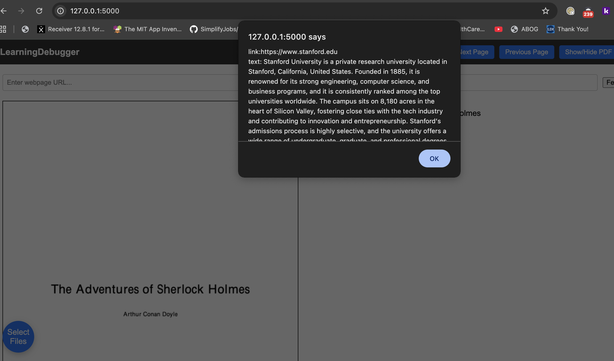

# Project Title

> AI Study tool that acts like a code debugger through documents 

## Team

| Name | GitHub | Email |
|------|--------|-------|
| Tanay Allaparti | [@tanay2405](https://github.com/tanay2405) | tanay.allaparti@sjsu.edu |
| Aaron Chen | [@Aaron2882](https://github.com/Aaron2882) | aaron.chen@sjsu.edu |
| Alvin Le | [@ALe-BD](https://github.com/ALe-BD) | alvin.le@sjsu.edu |
| Saivardan Mamidi | [@saimamidi01](https://github.com/saimamidi01) | saivardan.mamidi@sjsu.edu |

**Advisor:** [KaiKai Liu]

---
## Demo

Basic UI functionality and Step In output demo (Look at the screenshots for other output): [UI demo](https://drive.google.com/file/d/16XsUY231yJXZWnG5HBh0N4AHuJ3Zo0-q/view?usp=sharing)

Webpage URL fetch and PDF export demo [PDF export demo]
(https://drive.google.com/file/d/1Yx7nBlVo-ft7-BIyjnUT5rMikSesaomh/view?usp=sharing)


**Live Demo:** [URL if deployed]

---
## Project Description

This web application is an AI assistant that allows the user to cluster study material like a textbook or notes. It allows the user to view those documents going line by line and stepping in and out to different materials to the relevant sections within those materials like a debugger. If you do not have enough source, the app will provide the user relevant websites. The AI chat at the side can provide clear summaries about the page/subject highlighted by the user. 

---
## Proof of Concept Scope
The proof of concepts demonstrates functional UI line by line document navigation, ability to generate pdf from webpage link, ability to change pages, and step in, step out. Step in output can be seen, but the UI has not been updated yet with the relevant text highlighted for that document. Website link and text are not updated on the UI, but the output can be seen. The chat functionality works where the user can ask for help, but chat history cannot store large amounts of text.
---
## Screenshots

| Feature | Screenshot |
|---------|------------|
| [Chat: Current Full Page into Context (to add current page in chat type "[Page]") |  |
| [Step In Output] |  |
| [Webpage Output] |  |

---

## Tech Stack

| Category | Technology |
|----------|------------|
| Frontend | HTML, CSS, JavaScript |
| Backend | Python (Flask), Ollama (local LLM) |
| Database | ChromaDB |
| Deployment | N/A |

---

## Getting Started

### Prerequisites

- [Flask] v.3.1.3+
- [flask_cors] v.6.0.2+
- [ollama] v.0.6.1+
- [fpdf2] v.2.8.4+
- [ollama] v.4.14.3+

### Installation

```bash
# Clone the repository
git clone https://github.com/SJSU-CMPE-195/group-project-group9.git
cd group-project-group9

# Install dependencies
pip install -r requirements.txt
pip install chromadb

# Run database migrations (if applicable)
[migration command]
```

---
### Running Locally

```bash
# Development mode
python ./src/app.py 

# The app will be available at http://localhost:5000
```

---
## What's Next (195B)
1. Implement other desired features as personal developed plans, generated study materials, clarifications and questions chat.
2. Detailed and appealing UI/UX, simple to use and understand; provides complete feedback, functionality, and support to users.
3. Fully functional backend and chromadb, possibly saved local storage in documents and history, possibly accounts, able to last long term with efficiency and error handling. 
4. Working to make the LLM searching for information and relevant sections more reliable. 

---
## Problem Statement

Students today heavily rely on digital devices to keep and learn from for their overall understanding in courses, but due to the large pools of information they have to go through on a daily basis they are often overwhelmed. Students are found to underperform on tests when multitasking beforehand, having a loss of focus switching through many different concepts.

## Solution

The LearningDebugger is a debugging-styled LLM study tool assisting in comprehension and navigation through texts for students. Users will be able to traverse line by line, step in and out of those concepts unfamiliar to them onto additional relevant resources for context and understanding and be provided an interactive chat where they can ask any additional questions. With this solution, it provides a way to quickly switch between notes, PDFs, info from sites, and other resources while providing additional features to build up overall understanding.

### Key Features

- Feature 1. Line-by-Line traversal, highlighting text focusing on one concept or sentence at a time
- Feature 2. Step in/out of text line, into layers of relevant conceptual information and explanations for comprehension
- Feature 3. Interactive AI chat, real-time questions and answers for extra clarification

---
### Running Tests

```bash
[test command]
```

---

## API Reference

<details>
<summary>Click to expand API endpoints</summary>

| Method | Endpoint | Description |
|--------|----------|-------------|
| GET | `/api/resource` | Get all resources |
| GET | `/api/resource/:id` | Get resource by ID |
| POST | `/api/resource` | Create new resource |
| PUT | `/api/resource/:id` | Update resource |
| DELETE | `/api/resource/:id` | Delete resource |

</details>

---

## Project Structure

```
.
├── [folder]/           # Description
├── src/                # Source code files
├── tests/              # Test files
├── docs/               # Documentation files
└── README.md
```

---

## Contributing

1. Create a feature branch (`git checkout -b feature/amazing-feature`)
2. Commit your changes (`git commit -m 'Add amazing feature'`)
3. Push to the branch (`git push origin feature/amazing-feature`)
4. Open a Pull Request

### Branch Naming

- `feature/` - New features
- `fix/` - Bug fixes
- `docs/` - Documentation updates
- `refactor/` - Code refactoring

### Commit Messages

Use clear, descriptive commit messages:
- `Add user authentication endpoint`
- `Fix database connection timeout issue`
- `Update README with setup instructions`

---

## Acknowledgments

- Project Advisor KaiKai Liu for guidance and feedback during development
- Flask, Flask-CORS, Ollama for open-source tools building project architecture and core functionality
- All team members for collaboration and contributions

---

## License

This project is licensed under the <FILL IN> License - see the [LICENSE](LICENSE) file for details.

---

*CMPE 195A/B - Senior Design Project | San Jose State University | Spring 2026*
