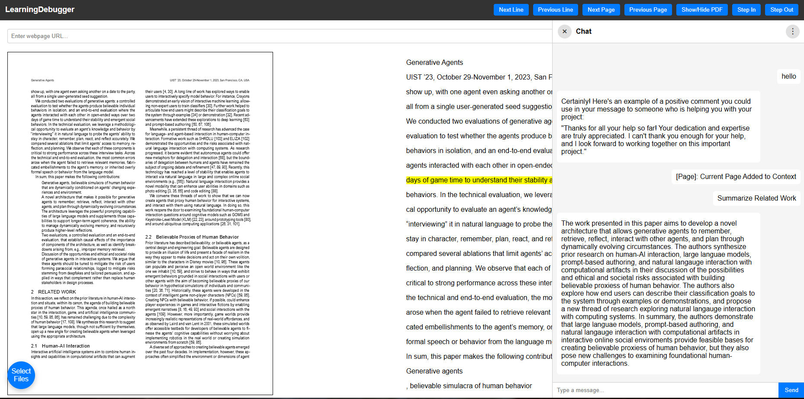

# Project Title

> AI Study tool that acts like a code debugger through documents 

## Team

| Name | GitHub | Email |
|------|--------|-------|
| Tanay Allaparti | [@tanay2405](https://github.com/tanay2405) | tanay.allaparti@sjsu.edu |
| Aaron Chen | [@Aaron2882](https://github.com/Aaron2882) | aaron.chen@sjsu.edu |
| Alvin Le | [@ALe-BD](https://github.com/ALe-BD) | alvin.le@sjsu.edu |
| Saivardan Mamidi | [@saimamidi01](https://github.com/saimamidi01) | saivardan.mamidi@sjsu.edu |

**Advisor:** [KaiKai Liu]

---
## Demo

[Link to demo video or GIF]

**Live Demo:** [URL if deployed]

---
## Project Description

This web application is an AI assistant that allows the user to cluster study material like a textbook or notes. It allows the user to view those documents going line by line and stepping in and out to different materials to the relevant sections within those materials like a debugger. If you do not have enough source, the app will provide the user relevant websites. The AI chat at the side can provide clear summaries about the page/subject highlighted by the user. 

---
## Proof of Concept Scope
[What does this PoC demonstrate? What is NOT included yet?]

---
## Screenshots

| Feature | Screenshot |
|---------|------------|
| [Chat: Current Full Page into Context] |  |
| [Feature 2] |  |

---

## Tech Stack

| Category | Technology |
|----------|------------|
| Frontend | HTML, CSS, JavaScript |
| Backend | Python (Flask), Ollama (local LLM) |
| Database | ChromaDB |
| Deployment | N/A |

---

## Getting Started

### Prerequisites

- [Flask] v.3.1.3+
- [flask_cors] v.6.0.2+
- [ollama] v.0.6.1+

### Installation

```bash
# Clone the repository
git clone https://github.com/SJSU-CMPE-195/group-project-group9.git
cd group-project-group9

# Install dependencies
pip install -r requirements.txt

# Run database migrations (if applicable)
[migration command]
```

---
### Running Locally

```bash
# Development mode
python ./src/app.py 

# The app will be available at http://localhost:5000
```

---
## What's Next (195B)
1. Implement other desired features as personal developed plans, generated study materials, clarifications and questions chat.
2. Detailed and appealing UI/UX, simple to use and understand; provides complete feedback, functionality, and support to users.
3. Fully functional backend, possibly saved local storage in documents and history, possibly accounts, able to last long term with efficiency and error handling. 
4. Working to make the LLM searching for information and relevant sections more reliable. 

---
## Problem Statement

[2-3 sentences describing the problem you're solving and why it matters]

## Solution

[2-3 sentences describing your solution approach]

### Key Features

- Feature 1
- Feature 2
- Feature 3

---
### Running Tests

```bash
[test command]
```

---

## API Reference

<details>
<summary>Click to expand API endpoints</summary>

| Method | Endpoint | Description |
|--------|----------|-------------|
| GET | `/api/resource` | Get all resources |
| GET | `/api/resource/:id` | Get resource by ID |
| POST | `/api/resource` | Create new resource |
| PUT | `/api/resource/:id` | Update resource |
| DELETE | `/api/resource/:id` | Delete resource |

</details>

---

## Project Structure

```
.
├── [folder]/           # Description
├── src/                # Source code files
├── tests/              # Test files
├── docs/               # Documentation files
└── README.md
```

---

## Contributing

1. Create a feature branch (`git checkout -b feature/amazing-feature`)
2. Commit your changes (`git commit -m 'Add amazing feature'`)
3. Push to the branch (`git push origin feature/amazing-feature`)
4. Open a Pull Request

### Branch Naming

- `feature/` - New features
- `fix/` - Bug fixes
- `docs/` - Documentation updates
- `refactor/` - Code refactoring

### Commit Messages

Use clear, descriptive commit messages:
- `Add user authentication endpoint`
- `Fix database connection timeout issue`
- `Update README with setup instructions`

---

## Acknowledgments

- [Resource/Library/Person]
- [Resource/Library/Person]

---

## License

This project is licensed under the <FILL IN> License - see the [LICENSE](LICENSE) file for details.

---

*CMPE 195A/B - Senior Design Project | San Jose State University | Spring 2026*
